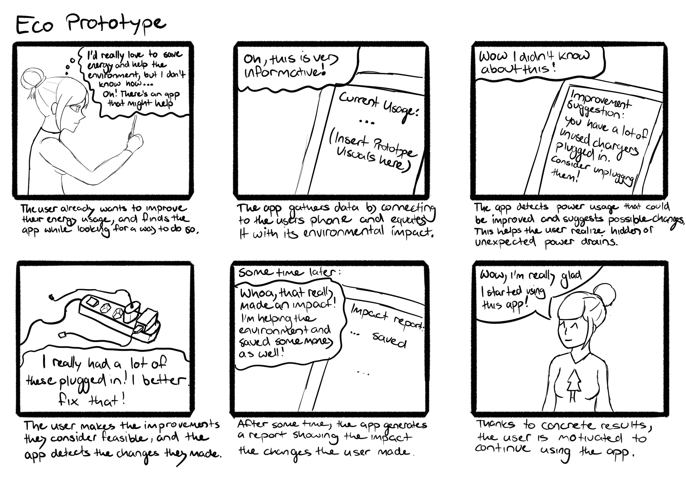
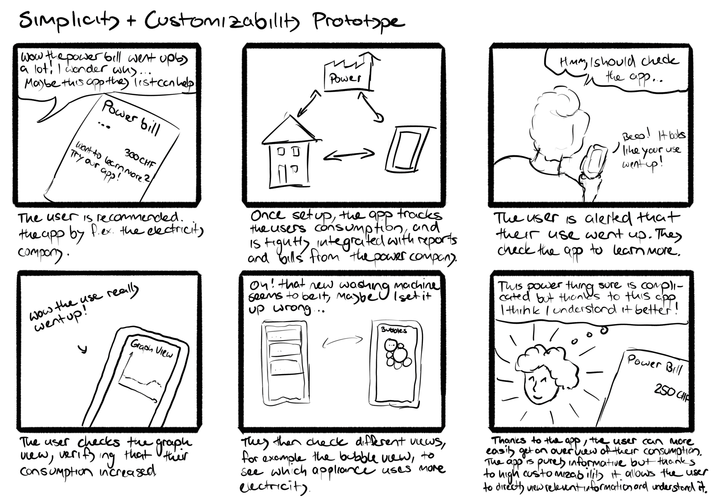
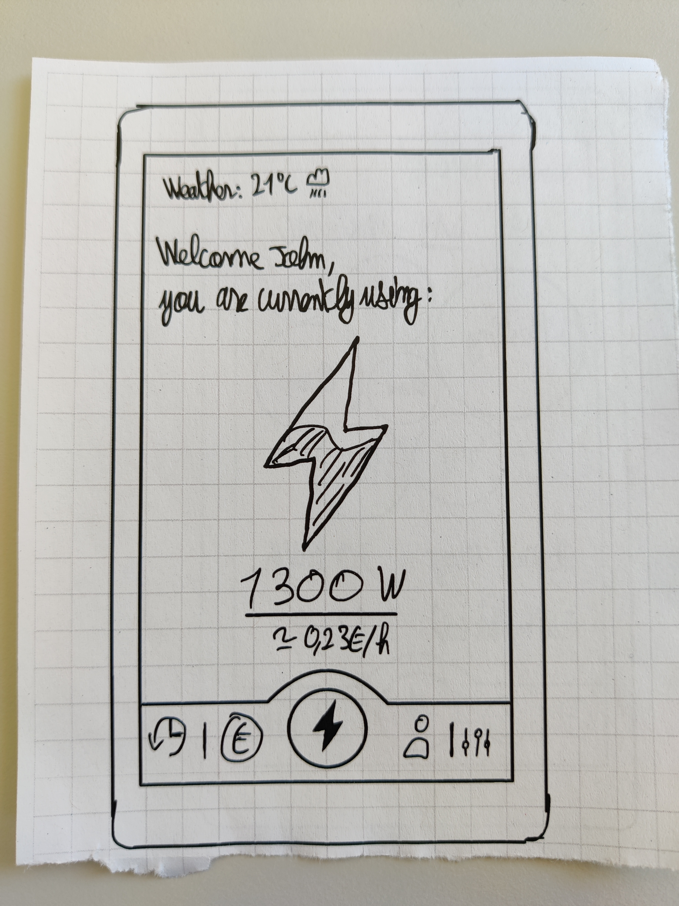
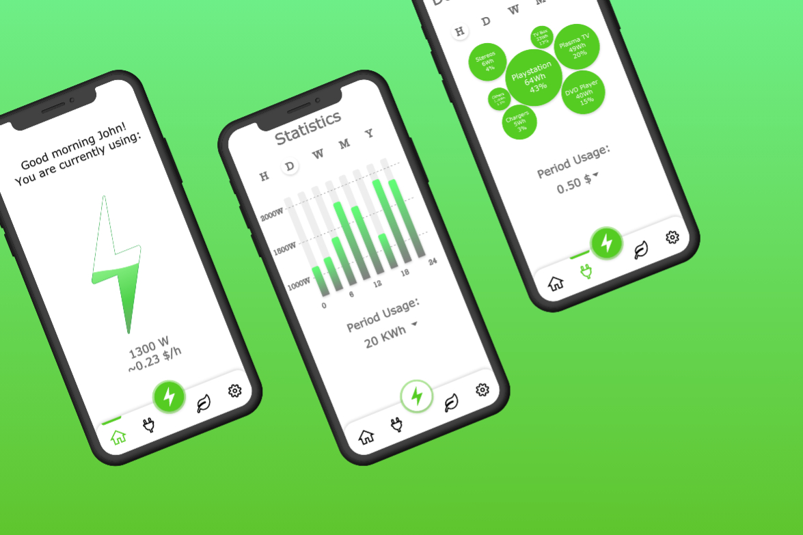
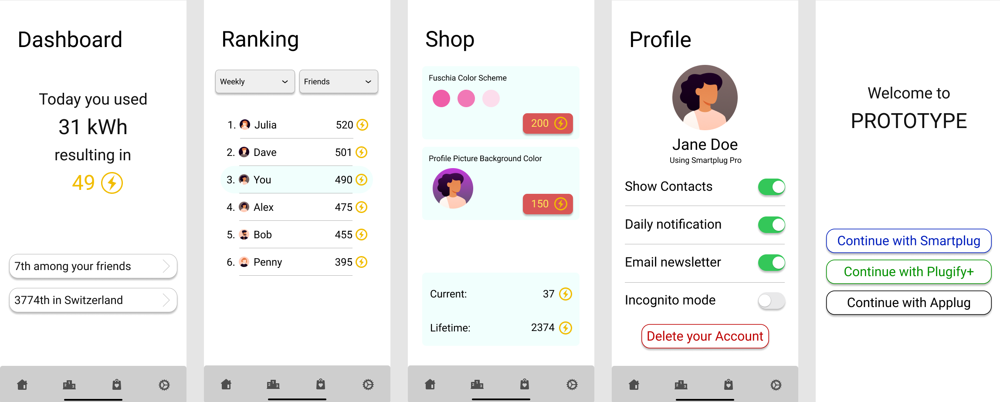

   &nbsp; &nbsp;
       

# Electricity Use, Group 06
#### Lothaire Aubergeon, Ian Hutter, Sophie Leichtle, Marco Schöb, Markus Wagner

## Project description

The goal of the project, which we have selected, wants to provide a solution to overcome the problem of electricity overuse in our world. We want to develop an application, which makes households more aware of their energy consumption and encourages them to consume less. 
What motivates us the most is that this is a pressing problem in the need for a solution in order to minimize climate change.

## Ideation
### Summary of sources
We found many different sources ranging from website and smartphone applications with and without additional hardware sensors via guidebooks to articles describing the electricity overuse in our society or providing useful tricks to save energy with little effort. 

Most scientific as well as popular articles concluded that curtailment of electricity use (including unplugging of not-used devices) is more efficient than more efficient appliances. In order to reach this goal, the people need to be made aware of their energy consumption. There are several approaches for this such as advertisements, a broader social discourse as well as smartphone apps, which will be discussed further below. Moreover, making the people more aware of the impact that their energy use has on the environment, resulted in a significant decrease in energy consumption. 

The most related solutions regarding the energy overuse topic are two smartphone appliances and an online tool:
The first one is an online energy-calculator by EWZ, the electricity provider of the city of Zurich. After answering some questions such as the age of the apartment or house, respectively, the number of people living there and the kind of heating (oil-fired, electricity etc.), it shows the user a rough list of how much energy he or she has consumed in kWh and how much it will cost in CHF. The calculation is based on some default values derived from the questions answered.
The second approach that we found makes use of additional hardware sensors, which can measure the flow of electricity coming through the user’s electric panel and comes with a smartphone application using machine learning for evaluating the data. The app shows much more detailed information on the energy consumption such as when which device was in use. Furthermore, it can send notifications to the user when the app thinks that he or she forgot to shut down an appliance.
The third solution is the EDF & MOI smartphone app by the French electricity provider EDF. It shows the user his or her energy consumption in customizable time intervals in Euros or kWh as the user’s will. One can set a yearly goal which the user wants to reach and can receive the yearly bill divided into appliance categories.

The first image shows some screenshots from the hardware-based smartphone application and the second one the EDF & MOI app.

    
### "How might we" statements
    - How might we win people out of different demographics and with political options?
    - How might we incentivise people to use the app and keep using it? (How do we get them to care?)
    - How might we display the user’s energy use in a way they can understand?
    - How might we evaluate the impact/success of the app?
    - How might we integrate the app with other technologies/devices?

### Brainstorming

We took the brainstorming approach B where each of us first tried to find as many ideas as possible in 10 minutes. Afterwards we discussed the ideas and grouped them into
four categories and connected some of the ideas with relevance to each other. This was done in person using Miro.

## Low-fidelity Prototype

We started on Miro, grouping ideas we had into each our own ideas for a specific prototype. We then merged some that were similar and ended up with our three ideas: eco, gameification and simplicity/customizability. From there we created our storyboards, trying to figure out what kind of situations our prototypes would be fit for. After that, we started work on the protoype, starting from what kind of features and interactions we wanted and moving on to how to display them.

### Idea A (gamification prototype)

Our process for this prototype was that we first took many of the ideas from the brainstorming that included gamification and grouped them together. We then picked out some of them that seemed like a good fit and rounded out the prototype through discussing it. This idea was then drawn on paper into a paper prototype which meant that we had to start thinking about the visual design of it. This whole process resulted in a horizontal prototype that encompasses many of the aspects that a possible final app would have.

The ranking screen is central to the app, allowing you to compare yourself with others:

### Idea B (ecologic prototype)

The basic idea behind the ecologic prototype is that it shows you the impact of your electricity consumption but more importantly what you can do about it. Consequently the start/main menu has four panels that display the possible electricity savings in the top one, the current use on the middle-left panel, the impact of this use in the middle- right one and your use statistics on the bottom one.

Either by pressing one of the panels or on of the symbols in the taskbar on the bottom you get to the main menu current use, impact, statistics or tips page were you can see your different stats and edit the ones that are displayed in the main menu. The last symbol in the taskbar brings you to the settings page.

### Idea C (simple prototype)

    
The idea of this prototype is that the app solely displays data in a way that is simple and customizable, thus motivating the User to utilize it solely through ease of use. It allows the user to display data in a way they personally can understand and makes it easy to change up how things are displayed. The user can chose between five different visualizations, as well as switch between a representation in EUR or in kWh.

## Mid-fidelity Prototype

### Idea A (Simple Prototype)

This prototype for a mobile app consists of five panel. It starts on the Home Panel, where the App displays the current electricity use in Watts and in Dollars per hour.

To see a more detailed version of the user's electricity consumption, he can go over to the Current Usage Panel which displays the absolute and the relative power consumption of his devices. Using the Dropdown menu bellow the Bubble diagram, the unit of the power usage can be changed.

In case of the Stand-by devices, it is also possible to go even more into detail by clicking on the corresponding bubble. By clicking on the letters above the diagram, she can select the considered timeframe.

By pressing on the Lightning bolt, the user can choose the type of diagram he wants his electricity consumption displayed as. Here he has the choice between a line and column diagram. Like on the Current Usage panel, the considered timeframe and the unit of the power usage can be adjusted.

For tips on how to curb our electricity consumption she can take a look on our Reduction Tips Panel, which presents her a selection of specific and unspecific measures how to use less energy.

Finally, on the Settings panel, the user can see his Account and the Option to delete it, the currency that should be used and the option to display the cost for each bubble. Additionally, there are also the options to activate the welcome message on the Front Panel and the notifications.

### Idea B (Gamification Prototype)

This prototype is for a mobile app consisting of four main screens (and a login screen that is shown when you install the app for the first time). The bottom navigation allows the user to easily switch between the four screens.

First up is the dashboard, which shows the user how many coins they have earned that day and two shortcut buttons to quickly jump to a certain ranking.

Next is the ranking screen, where the user can check how well they are doing in different rankings. The prototype allows switching between two different groups and two different timeframes through dropdown menus at the top.

The third screen is the shop, where a user is able to buy certain enhancements or items. At the bottom the user is able to see how many coins they have earned and how many are still left to spend.

The last screen is the profile page, where the user profile and important settings can be changed. From here you can also delete your account which leads you back to the login screen.

### Peer feedback
#### Our testers
Lothaire Aubergeon : 09

Markus Wagner : 12

Sophie Leichtle: 15

#### Summary of feedback
Overall the peer feedback Idea A, the simple prototype, was very encouraging. The testers were especially positive about the overall look and feel of the app. But we also recieved a fair number of criticisms/suggested improvemts for our prototype. 

The most prominent one was the confusion about why the "Green Lightning" button showed statistics, while the home scrren featured a green lightning but was represented in the Taskbar with a house symbol. The suggested improvement for this was, that the "Home" button on the Taskbar should be replaced with a "Statistics" button which links to the usage statistics (and subsequenly relocated on the Taskbar). Conversely, the The "Green Lightning button in the middle of the taskbar should become the new Home button, as there is already a visible connection with the Lightning established. Another wish of the testers was a search function for the Tips, so you could consult them for example for a purchasing descision. Additionally there should be a Daily Challenge/Tip displayed on the Home Panel and sent as a notification to the phone. Also called for was a clarification of the measurment units "km per train", "km per car" and "L of water boiling": They should feature a bracketed annotation "energy equivalent). On the Current Usage Panel, some of the testers wanted to see other categorizations like "entertainment, climate, illumination, etc. Finally there was also the suggestion to add shortcuts to the home panel, which could be done in a sub panel way: For example the daily tip could be displayed there and by clicking on it, you are changing over to the tips menu.

The peer feedback we received for our IdeaB (gamification prototype) was generally really positive. The main point that the testers liked was that our app is simple to understand because of its clear structure and the core idea is executed well.  More specifically the testers mentioned that the flat four screen structure is easy to learn for new users. There are no nested or complicated screens, everything is part of four clearly distinct screens that you can switch between at anytime with the bottom bar. For example testers mentioned that “the learning curve is really flat” and “quickly being able to jump between all screens is great”. Our testers also all liked the overall idea with some calling it really creative and very interesting.

But of course, there was also some criticism and ideas for improvements. The main criticisms were that the settings ‘show contacts’ and ‘incognito mode’ sound very similar and the difference between them is not really clear. Secondly, the dashboard showing energy usage and coins can be confusing as more electricity usage means less coins. This inverse relation is not immediately obvious. Additionally, there is no info for the user on how they can improve their energy usage. Some other ideas for improvement include adding achievements or real-world incentives/prices, aggregating notifications based on user preference, daily challenges, tips on how to improve power consumption, redesigning the shop, thinking about how to handle households and showing historic data.

Moving forward, based on the feedback and our prototypes, we want to pursue a fusion of our current two prototypes. The gamification prototype is a promising start, but still lacks features in some parts. This is where we can use parts from our IdeaA. Integrating the visualizations from IdeaA that show the user their electricity usage and the tips on how to improve into the gamification prototype addresses many of the feedback ideas from our peers. 

## Hi-fidelity Prototype
The plan for our hi-fi prototype is a fusion of our two mid-fi protypes. We take the general structure of IdeaB that users liked in the feedback and expand it with features of IdeaA that testers were missing from IdeaB. The general idea is adding a fifth screen to IdeaB where you can see the electricity you are using (user feedback told us that they want a way to know how they are using electricity). We also plan on adding the tips from IdeaA as challenges onto the bottom half of the dashboard screen (user feedback told us that previously that section was confusing and not useful and that they want the app to provide ideas for reducing electricity usage). Lastly, we plan on adding tappable profiles for the users.

The core aspects for our hi-fi prototype are the following five screens:
- Dashboard screen: shows how many coins you earned today, shows daily challenges to help you improve electricity usage
- Ranking screen: shows how you rank compared to different groups of users on different timeframes (tapping on users shows you their profile) 
- Usage screen: shows intuitive and helpful visualizations of your electricity usage
- Shop screen: buy virtual (and maybe physical) items that enhance your app or how you appear on the rankings of others
- Profile screen: allows you to customize your profile and change some settings 

Ideas for the A/B test
- General
  - Put profile screen in upper right-hand corner separate from settings
  - Put settings in upper right-hand corner seperate from profile
  - Put Profile and settings together in upper right hand corner
  - When opening the app, start on the dashboard vs the rankings 
- Dashboard
  - Coin visualization: Have a sandwatch splitted into two parts or a the power counting up and the coins counting down for visualizing that more energy use results in fewer coins
  - Swipe accepted challenges away vs clicking on them to activate them
  - Adding rewards or pop-up notifications to challenges
- Ranking screen
  - For the global leaderboard show entire leaderboard vs just the section around your own score
- Usage screen
  - Try two different electricity usage vizualisations: graph or histogram
  - Bar chart vs line chart
  - Group the energy use in the stats by use-categories (entertainment, cooking etc.) or by appliances for better overview

    
## User study
### Goal of the User Study
In our user study we want to compare two different versions of our app that have numerous changes. The rough structure of the app remains the same for both versions, but we will vary the content on many of the screens quite a bit. This investigation is inspired by our mid-fi prototypes as we used some fancy designs (eg. bubbles to represent usage) but we are not sure if those designs are actually efficient to use.
Our A/B variants will help us decide on which way of structuring the content of the app acutally performs better. To do this, our A variant encompasses somewhat chaotic but fancy designs, using cards and bubbles, whereas our B variant is more structured, using lists and dropdowns. 

### Differences between A and B
Screen | A (the 'fancy' prototype) | B (the 'structured' prototype)
--- | --- | ---
Dashboard | Cards of different shapes and sizes and colors for each challenge | One single long list with all challenges
Rankings | Arrows to switch between different rankings | Dropdown menus to switch between different rankings
Usage | Bubbles of different sizes show different usages of electricity  | One single list of all usages
Shop | Available and already purchased items are in the same list | Purchased items are in a seperate tab
Settings | no difference | no difference

### Hypotheses
There will be no effect of the way content is structured on Task completion time
There will be no effect of the way content is structured on clicks needed
There will be no effect of the way content is structured on user satisfaction

### Data collection
We will use a timer that runs in the background which times the user throughout the whole study. We measure the time it takes for the user to complete all tasks. We also measure the amount of clicks and how many unneeded clicks users perform
We will also do a survey afterwards to get the users opinion on how well they liked the experience

### Experiment procedure
#### Task
locate the challenges section on the dashboard, locate and accept the dishwasher challenge, locate and dismiss the phone challenge
move on to the rankings, find your place on the monthly family ranking, then find your place on the annual country ranking
move on to the usage, find the electricity usage of your fridge over the last 24h, then find the electricity usage of your pc over the last 7 days
move on to the shop, find and equit theme X, then buy and equip theme Y

#### Apparatus
We use the app running on a laptop in the webbrowser. As it is a phone app, we use the Iphone X preset from the devtools of any common browser. The participant is seated at the table.

#### Preliminary protocol
[preliminary protocol](Deliverables/Study/Preliminary%20Study%20protocol%20G06.pdf)
